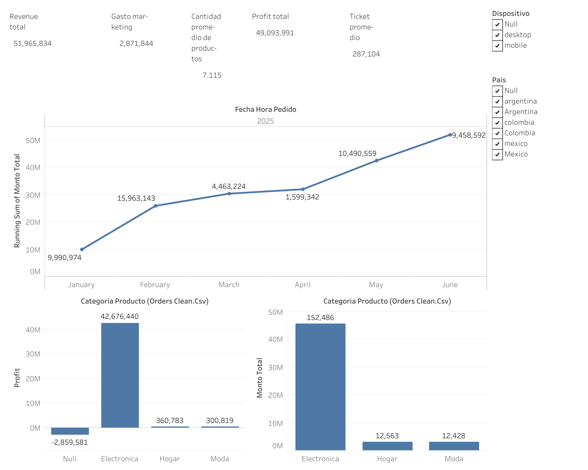

<a id="top"></a>

# 📊 RappiPlus: de datos a decisiones de negocio · From Data to Business Decisions

**🌎 Idioma / Language:** [🇪🇸 Español](#es) · [🇬🇧 English](#en)

---

<a id="es"></a>
[](https://public.tableau.com/views/Project_17885024557020/Dashboard2?:language=en-US&:sid=&:redirect=auth&:display_count=n&:origin=viz_share_link)

# RappiPlus: de datos a decisiones de negocio

Proyecto final de análisis de datos que evalúa el desempeño del servicio **RappiPlus** de punta a punta: calidad de datos, rentabilidad, embudo de conversión, retención de usuarios y validación estadística de un experimento A/B, con los resultados comunicados en un dashboard de BI.

🔗 **Dashboard interactivo (Tableau Public):** [Ver dashboard](https://public.tableau.com/views/Project_17885024557020/Dashboard2?:language=en-US&:sid=&:redirect=auth&:display_count=n&:origin=viz_share_link)

---

## 1. Problema o contexto de negocio

RappiPlus opera en tres países (**México, Colombia y Argentina**) y vende productos de las categorías Electrónica, Hogar y Moda. Para decidir dónde invertir, qué corregir y qué cambios lanzar, la dirección necesita responder preguntas como:

- ¿Podemos confiar en los datos que estamos usando para reportar?
- ¿El negocio es realmente rentable después de descontar costos de producto y marketing?
- ¿En qué punto del proceso de compra se nos van los usuarios?
- ¿Los usuarios regresan después de registrarse?
- ¿El nuevo diseño del checkout mejora la conversión, o la diferencia observada es ruido?

## 2. Objetivo del análisis

Convertir datos operativos y de comportamiento en **decisiones accionables**, siguiendo una lógica progresiva:

| # | Pregunta | Enfoque |
|---|----------|---------|
| 1 | ¿Podemos confiar en los datos? | Validación y limpieza en Python |
| 2 | ¿El negocio es rentable? | Revenue, COGS, marketing y profit |
| 3 | ¿Dónde se pierden los usuarios? | Funnel de conversión en SQL |
| 4 | ¿Los usuarios regresan? | Retención por cohortes en SQL |
| 5 | ¿Los cambios generan impacto? | Prueba Z de dos proporciones (A/B test) |
| 6 | ¿Cómo comunicamos los resultados? | Dashboard en Tableau |

## 3. Dataset utilizado

| Fuente | Contenido | Origen |
|--------|-----------|--------|
| `rappiplus_orders_raw.csv` | Pedidos: usuario, fecha, país, dispositivo, fuente de referencia, producto, cantidad, precio, descuento y monto total (25,100 filas en crudo) | CSV |
| `rappiplus_catalog.csv` | Costo unitario, categoría y proveedor por producto | CSV |
| `rappiplus_marketing_spend.csv` | Gasto diario en marketing por país y canal (1,620 filas) | CSV |
| `events` | Eventos de navegación por usuario (embudo de conversión) | PostgreSQL |
| `users` / `user_activity` | Registro de usuarios y actividad posterior (retención) | PostgreSQL |
| `experiment_checkout_ui.csv` | Experimento A/B del checkout: control vs. tratamiento (10,000 usuarios) | CSV |

**Periodo cubierto:** enero a junio de 2025.

## 4. Herramientas y tecnologías

- **Python:** `pandas`, `numpy`, `matplotlib`, `seaborn`
- **Estadística:** `statsmodels` (`proportions_ztest`), `scipy`
- **SQL (PostgreSQL):** CTEs, funciones de ventana (`LAG`, `FIRST_VALUE`), `DATE_TRUNC`, `EXTRACT`
- **Conexión a base de datos:** `SQLAlchemy`
- **Entorno:** Jupyter Notebook
- **BI:** Tableau Public

## 5. Proceso realizado

### Paso 1 · Calidad de datos
- Conversión de fechas a `datetime`.
- Eliminación de **100 pedidos duplicados** por `id_pedido` (25,100 → 25,000).
- Eliminación de filas sin `cantidad` o `precio_unitario` (quedan **24,950** pedidos).
- Validación de consistencia de montos: se contrastó `precio × cantidad − descuento` contra `monto_total`. Coinciden 23,805 de 25,000 pedidos; se recalculó el revenue con la fórmula consistente y la diferencia total fue mínima (~$2.3K sobre ~$52M).
- Revisión de nulos: `pais` (1.2%), `dispositivo`, `fuente_referencia`, `nombre_producto` y `categoria_producto` (≤0.12%).
- Exportación de los datasets limpios (`orders_clean.csv`, `catalog_clean.csv`, `marketing_clean.csv`) para el dashboard.

### Paso 2 · Rentabilidad (KPIs)
- Cruce de pedidos con el catálogo para calcular **COGS** por pedido.
- Cálculo de revenue, ganancia bruta, gasto de marketing, profit y margen neto.
- Ticket promedio, cantidad promedio por orden, producto más vendido y gasto por canal.

### Paso 3 · Funnel de conversión (SQL)
- Usuarios únicos por evento sobre la tabla `events`.
- Tasas de conversión paso a paso y global, y porcentaje de abandono (*drop-off*) con funciones de ventana.

### Paso 4 · Retención por cohortes (SQL)
- Cohorte definida por **mes de registro** (`users`).
- Cruce con `user_activity` para medir cuántos usuarios de cada cohorte siguen activos en cada periodo.

### Paso 5 · Experimento A/B
- Métrica principal: `convirtio` (1 = completó la compra).
- **H₀:** no hay diferencia en la tasa de conversión entre la UI actual y la nueva.
- **H₁:** sí existe una diferencia significativa.
- Prueba Z de dos muestras para proporciones, con α = 0.05.

### Paso 6 · Dashboard
- Visualización de los KPIs y hallazgos en Tableau Public.

## 6. Principales hallazgos

### 💰 Rentabilidad

| Indicador | Valor |
|-----------|------:|
| Revenue total | $51,965,834 |
| COGS total | $43,124,018 |
| Ganancia bruta | $8,841,816 (17.0% del revenue) |
| Gasto en marketing | $2,871,844 (5.5% del revenue) |
| **Profit** | **$5,969,972** |
| **Margen neto** | **11.49%** |

- **El negocio es rentable**, pero con márgenes ajustados: el costo de producto absorbe ~83% de los ingresos.
- **Alta concentración en un solo producto:** *Laptop-Gaming-16GB* es el más vendido por unidades (144,198) y por ingresos (~$43.4M, cerca del **84% del revenue total**). Por número de órdenes, en cambio, lidera *Blender-XL-Red* (4,176).
- **Ticket promedio:** $2,082.80 por orden.
- **Cantidad por orden:** promedio de 7.12 unidades frente a una mediana de 2, lo que indica **pedidos de volumen muy alto** que inflan el promedio.
- **Marketing repartido casi parejo** entre canales: social (34.1%), orgánico (33.9%) y búsqueda pagada (32.0%).

### 🛒 Funnel de conversión

| Etapa | Usuarios únicos | Paso a paso | Global |
|-------|----------------:|------------:|-------:|
| `add_to_cart` | 7,634 | 100% | 100% |
| `begin_checkout` | 7,208 | 94.42% | 94.42% |
| `purchase` | 6,240 | 86.57% | 81.74% |

- La **mayor fuga ocurre entre iniciar el checkout y completar la compra (13.43% de abandono)**, es decir, justo en la etapa que el experimento intenta mejorar.
- Desde el carrito hasta la compra se conserva el **81.74%** de los usuarios.

### 🔁 Retención por cohortes

- Se analizaron las cohortes de enero a mayo de 2025 (entre 1,104 y 1,299 usuarios cada una).
- En todas las cohortes, la actividad del mes 1 supera a la del mes de registro (entre **114.9% y 130.8%**), lo que sugiere que los usuarios **sí regresan** e incluso se activan más después de su primer mes.

### 🧪 Experimento A/B del checkout

| Grupo | Usuarios | Conversiones | Tasa de conversión |
|-------|---------:|-------------:|-------------------:|
| Control | 4,965 | 779 | 15.69% |
| Tratamiento | 5,035 | 820 | 16.29% |

- Diferencia observada: **+0.6 puntos porcentuales**.
- Estadístico Z = −0.8133, **p-value = 0.416** (> 0.05).
- **No se rechaza H₀:** no hay evidencia estadística de que la nueva UI mejore la conversión; la diferencia es compatible con el azar.

## 7. Recomendaciones e impacto para el negocio

1. **Reducir la dependencia de un solo producto.** Con ~84% del revenue en las laptops gaming, cualquier problema de proveedor, precio o demanda golpea directamente los resultados. Conviene diversificar el catálogo y revisar los márgenes de las demás categorías.
2. **Proteger y mejorar el margen.** Con 17% de margen bruto, renegociar costos con proveedores o ajustar precios/descuentos tiene un impacto directo en el profit: cada punto de margen bruto equivale a ~$520K.
3. **Priorizar la etapa checkout → compra.** Es donde más usuarios se pierden (13.4%). Aun recuperando una fracción, el efecto sobre el revenue sería significativo.
4. **No lanzar la nueva UI del checkout solo por la mejora observada.** El resultado no es significativo. Se recomienda extender el experimento (más muestra o más tiempo) o probar cambios más ambiciosos antes de invertir en un rediseño completo.
5. **Medir el retorno por canal de marketing.** El gasto está repartido casi en partes iguales sin criterio de desempeño visible. Cruzar el gasto con conversiones e ingresos por canal permitiría reasignar presupuesto hacia los canales más eficientes.
6. **Capitalizar la retención.** Como los usuarios regresan, conviene reforzar campañas de reactivación y recompra durante el primer mes posterior al registro.

## 8. Limitaciones y puntos a revisar

Para interpretar los resultados con criterio, conviene tener en cuenta lo siguiente:

- **Funnel incompleto:** la consulta solo ordena los eventos `page_view`, `view_item`, `add_to_cart`, `begin_checkout` y `purchase`, pero en los datos aparecen otros nombres (`first_visit`, `select_item`, `add_payment_info`). Por eso el embudo arranca en `add_to_cart` y no incluye las etapas previas ni el pago. Ajustar los nombres de evento permitiría un embudo completo.
- **Retención sobre 100%:** que la actividad del mes 1 supere la del mes 0 indica que la métrica depende de cómo se registra la actividad (el mes 0 solo captura los días posteriores al registro). Sirve como señal de regreso, pero no es una retención clásica; se recomienda complementarla con retención semanal.
- **Pedidos de volumen extremo:** la diferencia entre media y mediana de unidades por orden sugiere valores atípicos que conviene auditar, porque afectan el revenue, el ticket promedio y el ranking de productos.
- **Gasto de marketing sin canal:** 101 registros de marketing no tienen `canal`, por lo que el desglose por canal (~$2.69M) no cubre el total invertido (~$2.87M).
- **Diferencias de monto:** ~4.8% de los pedidos no cuadra con la fórmula `precio × cantidad − descuento`; el impacto agregado es pequeño, pero vale la pena identificar su origen.
- **Costo sin producto:** los pedidos sin `nombre_producto` no cruzan con el catálogo, por lo que su COGS no se contabiliza.

## 9. Cómo reproducir el análisis

```bash
pip install pandas numpy matplotlib seaborn sqlalchemy psycopg2-binary statsmodels scipy jupyter
jupyter notebook S12_Proyecto_Final.ipynb
```

> ⚠️ **Seguridad:** el notebook incluye credenciales de la base de datos en texto plano. Antes de publicar el repositorio, elimínalas y cárgalas desde variables de entorno (por ejemplo, con un archivo `.env` fuera del control de versiones).

## 10. Estructura del proyecto

```
├── S12_Proyecto_Final.ipynb   # Análisis completo
├── orders_clean.csv           # Pedidos limpios
├── catalog_clean.csv          # Catálogo limpio
├── marketing_clean.csv        # Gasto de marketing limpio
└── README.md                  # Bilingüe (ES/EN)
```
### Contacto

- 💼 LinkedIn: [Emma Solórzano Hernández Jáuregui](https://www.linkedin.com/in/emma-solorzano-hernandez-jauregui-200301345/)
- 📊 Tableau Public: [Ver perfil](https://public.tableau.com/app/profile/emma.solorzano7415/vizzes)

[⬆️ Volver arriba](#top) · [🇬🇧 Read in English](#en)

---

<a id="en"></a>
[](https://public.tableau.com/views/Project_17885024557020/Dashboard2?:language=en-US&:sid=&:redirect=auth&:display_count=n&:origin=viz_share_link)

# RappiPlus: From Data to Business Decisions

End-to-end data analysis project evaluating the performance of the **RappiPlus** service: data quality, profitability, conversion funnel, user retention, and statistical validation of an A/B experiment, with the results communicated in a BI dashboard.

🔗 **Interactive dashboard (Tableau Public):** [View dashboard](https://public.tableau.com/views/Project_17885024557020/Dashboard2?:language=en-US&:sid=&:redirect=auth&:display_count=n&:origin=viz_share_link)

---

## 1. Business problem and context

RappiPlus operates in three countries (**Mexico, Colombia, and Argentina**) and sells products in the Electronics, Home, and Fashion categories. To decide where to invest, what to fix, and which changes to launch, leadership needs answers to questions such as:

- Can we trust the data we use for reporting?
- Is the business actually profitable after product and marketing costs?
- At which point of the purchase process do we lose users?
- Do users come back after signing up?
- Does the new checkout design improve conversion, or is the observed difference just noise?

## 2. Analysis objective

Turn operational and behavioral data into **actionable decisions**, following a progressive logic:

| # | Question | Approach |
|---|----------|----------|
| 1 | Can we trust the data? | Validation and cleaning in Python |
| 2 | Is the business profitable? | Revenue, COGS, marketing, and profit |
| 3 | Where do we lose users? | Conversion funnel in SQL |
| 4 | Do users come back? | Cohort retention in SQL |
| 5 | Do changes make an impact? | Two-proportion Z-test (A/B test) |
| 6 | How do we communicate results? | Tableau dashboard |

## 3. Datasets

| Source | Content | Origin |
|--------|---------|--------|
| `rappiplus_orders_raw.csv` | Orders: user, date, country, device, referral source, product, quantity, price, discount, and total amount (25,100 raw rows) | CSV |
| `rappiplus_catalog.csv` | Unit cost, category, and supplier per product | CSV |
| `rappiplus_marketing_spend.csv` | Daily marketing spend by country and channel (1,620 rows) | CSV |
| `events` | User navigation events (conversion funnel) | PostgreSQL |
| `users` / `user_activity` | User sign-ups and subsequent activity (retention) | PostgreSQL |
| `experiment_checkout_ui.csv` | Checkout A/B experiment: control vs. treatment (10,000 users) | CSV |

**Period covered:** January to June 2025.

## 4. Tools and technologies

- **Python:** `pandas`, `numpy`, `matplotlib`, `seaborn`
- **Statistics:** `statsmodels` (`proportions_ztest`), `scipy`
- **SQL (PostgreSQL):** CTEs, window functions (`LAG`, `FIRST_VALUE`), `DATE_TRUNC`, `EXTRACT`
- **Database connection:** `SQLAlchemy`
- **Environment:** Jupyter Notebook
- **BI:** Tableau Public

## 5. Process

### Step 1 · Data quality
- Date conversion to `datetime`.
- Removal of **100 duplicate orders** by `id_pedido` (25,100 → 25,000).
- Removal of rows missing `cantidad` or `precio_unitario` (**24,950** orders remain).
- Amount consistency check: `price × quantity − discount` was compared against `monto_total`. 23,805 of 25,000 orders match; revenue was recalculated with the consistent formula and the total difference was minimal (~$2.3K out of ~$52M).
- Missing value review: `pais` (1.2%), `dispositivo`, `fuente_referencia`, `nombre_producto`, and `categoria_producto` (≤0.12%).
- Export of the clean datasets (`orders_clean.csv`, `catalog_clean.csv`, `marketing_clean.csv`) for the dashboard.

### Step 2 · Profitability (KPIs)
- Orders joined with the catalog to compute **COGS** per order.
- Calculation of revenue, gross profit, marketing spend, profit, and net margin.
- Average ticket, average quantity per order, best-selling product, and spend by channel.

### Step 3 · Conversion funnel (SQL)
- Unique users per event from the `events` table.
- Step-by-step and overall conversion rates, and drop-off percentage using window functions.

### Step 4 · Cohort retention (SQL)
- Cohort defined by **sign-up month** (`users`).
- Joined with `user_activity` to measure how many users in each cohort remain active in each period.

### Step 5 · A/B experiment
- Primary metric: `convirtio` (1 = completed the purchase).
- **H₀:** there is no difference in conversion rate between the current UI and the new one.
- **H₁:** there is a significant difference.
- Two-sample Z-test for proportions, with α = 0.05.

### Step 6 · Dashboard
- Visualization of KPIs and findings in Tableau Public.

## 6. Key findings

### 💰 Profitability

| Metric | Value |
|--------|------:|
| Total revenue | $51,965,834 |
| Total COGS | $43,124,018 |
| Gross profit | $8,841,816 (17.0% of revenue) |
| Marketing spend | $2,871,844 (5.5% of revenue) |
| **Profit** | **$5,969,972** |
| **Net margin** | **11.49%** |

- **The business is profitable**, but with tight margins: product cost absorbs ~83% of revenue.
- **High concentration in a single product:** *Laptop-Gaming-16GB* is the top seller by units (144,198) and by revenue (~$43.4M, close to **84% of total revenue**). By number of orders, however, *Blender-XL-Red* leads (4,176).
- **Average ticket:** $2,082.80 per order.
- **Quantity per order:** average of 7.12 units versus a median of 2, indicating **very high-volume orders** that inflate the average.
- **Marketing spread almost evenly** across channels: social (34.1%), organic (33.9%), and paid search (32.0%).

### 🛒 Conversion funnel

| Stage | Unique users | Step-to-step | Overall |
|-------|-------------:|-------------:|--------:|
| `add_to_cart` | 7,634 | 100% | 100% |
| `begin_checkout` | 7,208 | 94.42% | 94.42% |
| `purchase` | 6,240 | 86.57% | 81.74% |

- The **biggest drop occurs between starting checkout and completing the purchase (13.43% drop-off)**, which is exactly the stage the experiment aims to improve.
- From cart to purchase, **81.74%** of users are retained.

### 🔁 Cohort retention

- Cohorts from January to May 2025 were analyzed (between 1,104 and 1,299 users each).
- In every cohort, month-1 activity exceeds that of the sign-up month (between **114.9% and 130.8%**), suggesting that users **do come back** and even become more active after their first month.

### 🧪 Checkout A/B experiment

| Group | Users | Conversions | Conversion rate |
|-------|------:|------------:|----------------:|
| Control | 4,965 | 779 | 15.69% |
| Treatment | 5,035 | 820 | 16.29% |

- Observed difference: **+0.6 percentage points**.
- Z = −0.8133, **p-value = 0.416** (> 0.05).
- **H₀ is not rejected:** there is no statistical evidence that the new UI improves conversion; the difference is consistent with chance.

## 7. Recommendations and business impact

1. **Reduce dependence on a single product.** With ~84% of revenue in gaming laptops, any supplier, pricing, or demand issue hits results directly. Diversify the catalog and review margins in the other categories.
2. **Protect and improve margin.** With a 17% gross margin, renegotiating supplier costs or adjusting prices/discounts has a direct impact on profit: each point of gross margin is worth ~$520K.
3. **Prioritize the checkout → purchase stage.** This is where most users are lost (13.4%). Even recovering a fraction would significantly affect revenue.
4. **Do not launch the new checkout UI based solely on the observed improvement.** The result is not significant. Extend the experiment (larger sample or longer duration) or test bolder changes before investing in a full redesign.
5. **Measure return by marketing channel.** Spend is split almost equally with no visible performance criterion. Crossing spend with conversions and revenue per channel would allow budget to be reallocated toward the most efficient channels.
6. **Capitalize on retention.** Since users do come back, reinforce reactivation and repurchase campaigns during the first month after sign-up.

## 8. Limitations and points to review

To interpret the results with care, keep the following in mind:

- **Incomplete funnel:** the query only orders the events `page_view`, `view_item`, `add_to_cart`, `begin_checkout`, and `purchase`, but the data contains other event names (`first_visit`, `select_item`, `add_payment_info`). As a result, the funnel starts at `add_to_cart` and excludes earlier stages and the payment step. Adjusting the event names would allow a complete funnel.
- **Retention above 100%:** month-1 activity exceeding month-0 activity indicates that the metric depends on how activity is recorded (month 0 only captures the days after sign-up). It works as a signal that users return, but it is not classic retention; complementing it with weekly retention is recommended.
- **Extreme-volume orders:** the gap between mean and median units per order suggests outliers that should be audited, since they affect revenue, average ticket, and the product ranking.
- **Marketing spend without a channel:** 101 marketing records have no `canal`, so the channel breakdown (~$2.69M) does not cover the total invested (~$2.87M).
- **Amount discrepancies:** ~4.8% of orders do not match the `price × quantity − discount` formula; the aggregate impact is small, but the source is worth identifying.
- **Cost without product:** orders with no `nombre_producto` do not match the catalog, so their COGS is not counted.

## 9. How to reproduce

```bash
pip install pandas numpy matplotlib seaborn sqlalchemy psycopg2-binary statsmodels scipy jupyter
jupyter notebook S12_Proyecto_Final.ipynb
```

> ⚠️ **Security:** the notebook contains database credentials in plain text. Before publishing the repository, remove them and load them from environment variables (for example, with a `.env` file kept out of version control).

## 10. Project structure

```
├── S12_Proyecto_Final.ipynb   # Full analysis
├── orders_clean.csv           # Clean orders
├── catalog_clean.csv          # Clean catalog
├── marketing_clean.csv        # Clean marketing spend
└── README.md                  # Bilingual (ES/EN)
```
###  Contact

- 💼 LinkedIn: [Emma Solórzano Hernández Jáuregui](https://www.linkedin.com/in/emma-solorzano-hernandez-jauregui-200301345/)
- 📊 Tableau Public: [View profile](https://public.tableau.com/app/profile/emma.solorzano7415/vizzes)
  
[⬆️ Back to top](#top) · [🇪🇸 Leer en español](#es)
